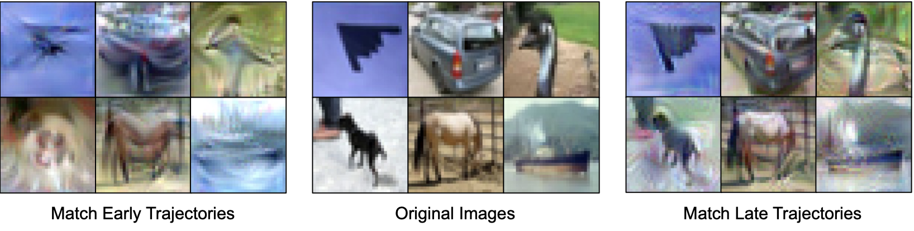
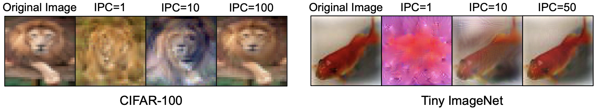

# [ICLR 2024] Towards Lossless Dataset Distillation via Difficulty-Aligned Trajectory Matching

## [Project Page](https://gzyaftermath.github.io/DATM/) | [Paper](https://arxiv.org/abs/2310.05773) | [Distilled Datasets](https://drive.google.com/drive/folders/1kZlYgiVrmFEz0OUyxnww3II7FBPQe7W0)
To achieve lossless dataset distillation, an intuitive idea is to increase the size of the synthetic dataset.
However, previous dataset distillation methods tend to perform worse than random selection as IPC (i.e., data keep ratio) increases.

To address this issue, we find the difficulty of the generated patterns should be aligned with the size of the synthetic dataset
(avoid generating patterns that are too easy or too difficult).

By doing so, our method remains effective in high IPC cases and achieves lossless dataset distillation for the very first time.

What do easy patterns and hard patterns look like?






## News
16 May. The implementation of DATM_with_[TESLA](https://github.com/justincui03/tesla) is merged. Thanks for the PR from [Yue XU](https://github.com/silicx)!

## Getting Started
1. Create environment as follows
```
conda env create -f environment.yaml
conda activate distillation
```
2. Generate expert trajectories
```
cd buffer
python buffer_FTD.py --dataset=CIFAR10 --model=ConvNet --train_epochs=100 --num_experts=100 --zca --buffer_path=../buffer_storage/ --data_path=../dataset/ --rho_max=0.01 --rho_min=0.01 --alpha=0.3 --lr_teacher=0.01 --mom=0. --batch_train=256
```
3. Perform the distillation
```
cd distill
python DATM.py --cfg ../configs/xxxx.yaml
```
`DATM_tesla.py` is a [TESLA](https://github.com/justincui03/tesla) implementation of DATM, which could greatly reduce the VRAM usage, *e.g.* ~12G for CIFAR10 and IPC=1000.

## Evaluation
We provide a simple script for evaluating the distilled datasets.
```
cd distill
python evaluation.py --lr_dir=path_to_lr --data_dir=path_to_images --label_dir=path_to_labels --zca
```
## Acknowledgement
Our code is built upon [MTT](https://github.com/GeorgeCazenavette/mtt-distillation), [FTD](https://github.com/AngusDujw/FTD-distillation) and [TESLA](https://github.com/justincui03/tesla).
## Citation
If you find our code useful for your research, please cite our paper.
```
@inproceedings{guo2024lossless,
      title={Towards Lossless Dataset Distillation via Difficulty-Aligned Trajectory Matching}, 
      author={Ziyao Guo and Kai Wang and George Cazenavette and Hui Li and Kaipeng Zhang and Yang You},
      year={2024},
      booktitle={The Twelfth International Conference on Learning Representations}
}
```
